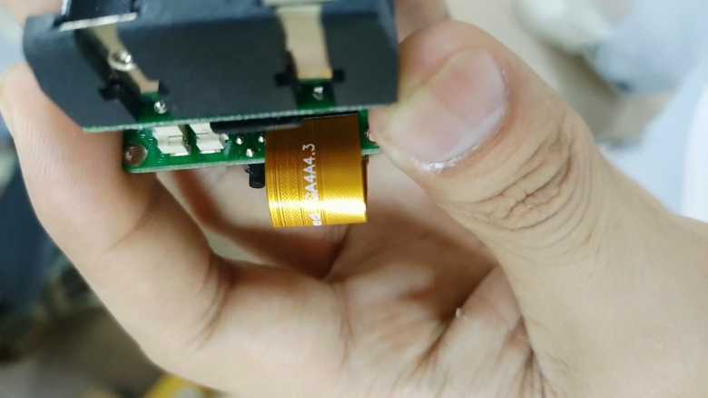
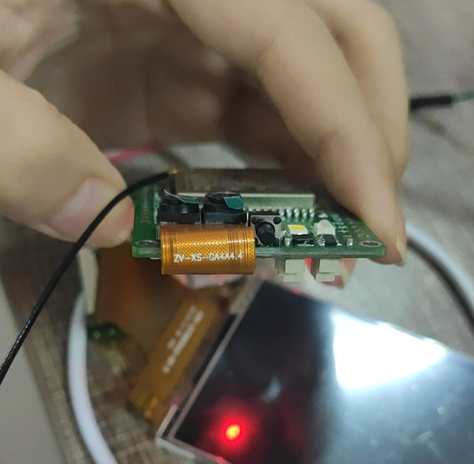

# MF Firmware related upgrade instructions

In the process of using the **MF face recognition module**, if there is a firmware bug, a new function firmware release, a mistakenly erased firmware, font resources, and image resources, then the firmware needs to be restored by burning.

## MF face recognition module firmware, resource description

**MF Face Recognition Module** The firmware, font resources, picture resources, descriptions are as follows:

| Type | Burning Address | Length | Description |
| -------- | -------- | ----- | ---- |
| Firmware | 0x000000 | | |
| Face Model | | | |
| Font Resources | | | |
| Picture Resources | | | |
| Board level configuration | 0x7FF000 | 4 KB | |
| Face Information | 0x800000 | 64 KB | |
| | | | |

> After getting the MF module, the general developer does not need to care about the resource distribution

MF firmware description

- VIS: Visible light (VIS)

- IR: infrared light (IR)

| Firmware classification | Direction | Protocol | Identification method | wechat | Number of firmware types |
| :--- | :--- | :--- | :--- | :--- | :--- |
| MF0 trial version module | horizontal version, vertical version | bin | vis | | 2 |
| MF1 offline module | horizontal and vertical | bin/json | vis+ir | | 8 |
| MF2 WeChat semi-finished product | Horizontal version, vertical version | bin | vis | Support | 2 |
| MF4 WeChat (finished product) | Vertical version | bin | vis | Support | 1 |
| MF5 WeChat (finished product) | Vertical version | bin/json | vis | Support | 2 |

- Font resources
- Picture resources

## MF firmware burning (upgrade, restore factory configuration) steps

In the process of using the **MF face recognition module**, if there is a firmware bug, a new function firmware release, a mistakenly erased firmware, font resources, and image resources, then the firmware needs to be restored by burning.

### Preparation:

Before upgrading and restoring the factory configuration **MF face recognition module**, we need to prepare software and hardware.

**Hardware preparation:**

 - **MF Face Recognition Module**

 - USB Type-C data cable

**Software preparation:**

  - Burning software: kflash_gui (Kflash_gui v1.6.5 version is used here)

  **Download link:**

  - Github: [kflash_gui](https://github.com/Sipeed/kflash_gui)

  - Sipeed: [Sipeed official download site-kflash_gui](https://dl.sipeed.com/MAIX/tools/kflash_gui/kflash_gui_v1.6.5)

  - Burn resource files (burn according to the situation): **MF face recognition module firmware**, algorithm model files, font resource files, image resource files

  Get the resource files and send a unified email to: Email: Support@sipeed.com

  The recommended email format is as follows:

  > Problem type: [MF firmware resource acquisition]
  >
  > Use hardware/firmware version: [MF0/MF1/MF2/MF4/MF5]
  >
  > Content: [Get the latest firmware/Firmware is missing/Model is missing (describe the relevant situation)]
  >
  > Machine code: [xxxxxxxxxxxxxxxxxxxxx (only required when the model is lost)]

### Burn firmware, resource files

Use the USB Type-C data cable to connect the **MF face recognition module** to the computer

Open Kflash_gui, select the file to be burned, select the version (default is `automatic selection`, if the burn fails, select `MaixDuino`), select the serial port number (CH522 has two serial ports, try the other one if it fails), configure the wave Special rate (default is `150000`, if programming fails, reduce the baud rate appropriately, such as `115200`)

## How to get Key (Machine Code)

During use, if the model of the module is lost or needs to be replaced, you need to send the `Key` to <Support@sipeed.com>

The recommended email format is as follows:

First download [key_gen.bin](https://fdvad021asfd8q.oss-cn-hangzhou.aliyuncs.com/Sipeed_M1/firmware/key_gen_v1.2.bin)

After using the `kflash_gui` to burn the firmware `ken_gen.bin` into the module, open the serial port and the baud rate is `115200,8,N,1`

> **[kflash_gui](https://github.com/Sipeed/kflash_gui/releases)** is K210 firmware burning tool, source code: [**Sipeed/kflash_gui**](https://github.com/ Sipeed/kflash_gui)

It is recommended to use [`XCOM`](tools/XCOM_V2.2.exe) to view the serial port information

Tap `DTR` and release it to reset the module and see the startup information

## MF Firmware Version Description

Due to the different imaging directions of the cameras, there are two firmware versions: horizontal and vertical versions;

How to confirm the firmware corresponding to the camera: (identified by the camera silkscreen)

| Horizontal board | Vertical board |
| --- | --- |
|  |  |
